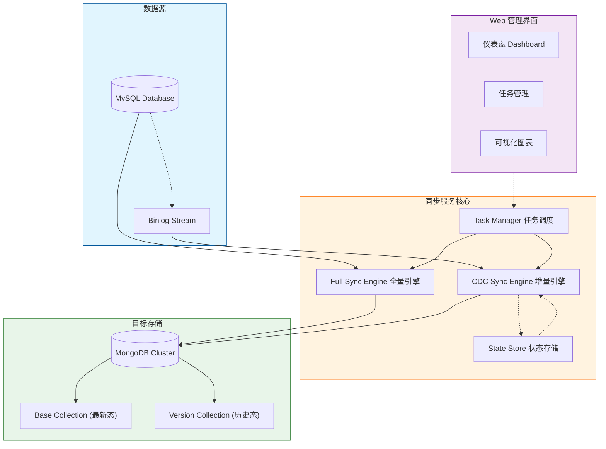

# MySQL to MongoDB Sync Service (MySQL 转 MongoDB 数据同步服务)

[](https://github.com/your-org/mysql-to-mongo)
[](https://www.python.org/)
[](https://www.mysql.com/)
[](https://www.mongodb.com/)
[](https://www.docker.com/)

## 📖 项目简介 (Introduction)

**MySQL to MongoDB Sync Service** 是一款企业级的数据同步中间件，专注于将 MySQL 数据实时、高效地同步至 MongoDB。它不仅支持**全量历史数据迁移**，还集成了基于 Binlog 的 **CDC (Change Data Capture)** 机制，实现毫秒级的增量数据实时同步。

本项目专为高可用和数据一致性设计，内置了现代化的 **Web 管理界面**，用户可以通过浏览器轻松完成任务创建、状态监控和数据可视化分析。

---

## 🏗 系统架构 (Architecture)

本系统采用模块化设计，核心组件包括同步引擎（Sync Engine）、任务管理器（Task Manager）和持久化存储（State Store）。



---

## ✨ 核心特性 (Features)

*   **🖥️ 现代化 Web UI**: 内置 Vue3 + Element Plus 管理后台，提供直观的操作体验。
*   **🚀 全量与增量无缝切换**: 自动完成历史数据全量迁移后，无缝切换至 Binlog 增量监听模式。
*   **🔄 实时 CDC 同步**: 基于 `mysql-replication` 库解析 ROW 格式 Binlog，实现低延迟数据同步。
*   **📊 可视化监控**: 
    *   **实时仪表盘**: 查看所有任务的运行状态、同步阶段、处理行数。
    *   **动态图表**: ECharts 驱动的实时流量趋势图（Insert/Update/Delete）及占比分析。
*   **📜 数据版本化 (Versioning)**: 支持保留 UPDATE 操作的历史版本，每一次变更都可追溯（存入 `_ver` 集合）。
*   **🗑️ 软删除支持 (Soft Delete)**: DELETE 操作可配置为软删除，保留数据快照以供审计或恢复。
*   **💾 断点续传**: 自动记录同步进度，服务崩溃或重启后自动恢复，保证数据不重不漏。
*   **⚡ 高性能引擎**: 全量阶段采用**并行预取**与 `insert_many` 快速路径，增量阶段支持**批量聚合**写入。
*   **🛡️ 自适应速率限制 (Adaptive Rate Limiter)**: 根据系统 LoadAvg 与 CPU 使用率自动调节同步速率，防止在业务高峰期占用过多资源。
*   **🚨 智能监控与告警**: 集成日志关键词监控与 Slack 告警，支持**仅记录不告警**模式，灵活控制通知噪声。

---

## 🖥️ Web 管理界面 (Web UI)

本项目提供功能完善的 Web 控制台，默认端口 `8000`。

### 1. 仪表盘 (Dashboard)
*   **全局概览**: 卡片式展示所有同步任务。
*   **关键指标**: 实时显示当前同步阶段（Full/Inc）、已处理数据量、当前 Binlog 位点及延迟情况。
*   **快捷操作**: 支持一键查看日志、打开监控图表、停止/重启任务。

### 2. 任务管理 (Task Management)
*   **向导式创建**: 通过简单的四步向导（基本信息 -> 源库配置 -> 目标库配置 -> 映射规则）快速创建同步任务。
*   **连接复用**: 支持保存 MySQL 和 MongoDB 连接配置，创建任务时直接选择，无需重复输入。
*   **同步模式**:
    *   **History Mode**: 保留变更历史，适用于数据审计。
    *   **Mirror Mode**: 镜像同步，目标端与源端保持完全一致。

### 3. 数据源管理 (Data Sources)
*   **统一管理**: 集中管理所有 MySQL 和 MongoDB 的连接信息。
*   **连接测试**: 内置连接测试功能，确保数据库连通性。

### 4. 实时监控 (Real-time Metrics)
*   **趋势分析**: 提供 Insert (Full/Inc)、Update、Delete 的实时速率曲线。
*   **数据统计**: 环形图展示各类操作的占比，直观了解数据变更分布。

---

## 🛠 支持环境 (Supported Environments)

| 组件 | 版本要求 | 说明 |
| :--- | :--- | :--- |
| **Python** | 3.8+ | 推荐使用 Python 3.9 或更高版本 |
| **MySQL** | 5.7, 8.0+ | 必须开启 Binlog (`binlog_format=ROW`) |
| **MongoDB** | 4.4+ | 推荐使用 Replica Set 模式以支持事务 |
| **Browser** | Chrome/Edge/Firefox | 需要支持 ES6+ 的现代浏览器 |

---

## 🚀 快速开始 (Quick Start)

### 方式一：Docker 部署（推荐）

1.  **构建镜像**
    ```bash
    docker build -t mysql-to-mongo:v1.1.0 .
    ```

2.  **启动服务**
    ```bash
    # 创建必要的挂载目录
    mkdir -p configs state connections configs_keys logs

    # 启动容器
    docker run -d \
      --name mysql-to-mongo \
      -p 8000:8000 \
      -e PYTHONUNBUFFERED=1 \
      -e TZ=Asia/Shanghai \
      -v $(pwd)/configs:/app/configs \
      -v $(pwd)/state:/app/state \
      -v $(pwd)/connections:/app/connections \
      -v $(pwd)/configs_keys:/app/configs_keys \
      -v $(pwd)/logs:/app/logs \
      --restart unless-stopped \
      mysql-to-mongo:v1.1.0
    ```

### 方式二：本地源码运行

1.  **克隆项目**
    ```bash
    git clone https://github.com/your-org/mysql-to-mongo.git
    cd mysql-to-mongo
    ```

2.  **安装依赖**
    ```bash
    pip install -r requirements.txt
    ```

3.  **启动服务**
    ```bash
    uvicorn app.main:app --host 0.0.0.0 --port 8000
    ```

4.  **访问管理后台**
    打开浏览器访问: `http://localhost:8000/ui/index.html`

---

## ⚙️ 性能调优 (Performance Tuning)

针对十亿级数据量的同步需求，系统提供了多项性能与资源控制参数，您可以在任务配置文件中进行调整：

| 参数 | 默认值 | 说明 |
| :--- | :--- | :--- |
| `full_sync_fast_insert_if_empty` | `true` | 全量同步时，如果目标集合为空，直接使用 `insert_many` 跳过 Upsert 检查，大幅提升写入速度。 |
| `prefetch_queue_size` | `2` | 全量同步的 MySQL 读取预取队列大小，实现读写并行。资源充足时可调大至 3-5。 |
| `rate_limit_enabled` | `true` | 是否启用自适应速率限制器。 |
| `max_load_avg_ratio` | `0.8` | 触发限速的系统负载阈值（LoadAvg / CPU核心数）。建议设置为 0.6-0.8。 |
| `min_sleep_ms` | `5` | 触发限速时的最小休眠时间（毫秒）。 |
| `max_sleep_ms` | `200` | 触发限速时的最大休眠时间（毫秒），系统会根据负载超出的程度在此范围内动态调整。 |
| `mongo_compressors` | `["snappy", "zlib"]` | MongoDB 网络传输压缩算法，有效降低带宽占用。 |

### 🛡️ 自适应速率限制器详解 (Adaptive Rate Limiter)

为了防止同步任务在业务高峰期占用过多的 CPU 或 I/O 资源，系统内置了智能限速机制。

**工作原理：**
1.  **系统负载监控**: 实时采集操作系统的 Load Average (1分钟均值)。
2.  **阈值判断**: 计算 `Current Load / CPU Cores`，若超过配置的 `max_load_avg_ratio` (默认 0.8)，则判定为系统过载。
3.  **写入延迟反馈**: 监控 MongoDB 的写入延迟（Moving Average），若延迟显著升高，也会触发限速。
4.  **动态休眠**: 一旦触发限速，同步线程会在每批次写入后自动休眠。休眠时间根据负载超出的程度在 `min_sleep_ms` 到 `max_sleep_ms` 之间线性增加。

**优化建议：**
*   **资源敏感型环境**: 将 `max_load_avg_ratio` 调低至 `0.5` - `0.6`。
*   **追求极致速度**: 若运行在专用同步机器上，可将 `rate_limit_enabled` 设置为 `false` 关闭限速。


---

## ⚙️ 配置说明 (Configuration)

### MySQL 配置要求
MySQL 必须开启 Binary Log 并设置为 ROW 模式：
```ini
[mysqld]
server_id = 1
log_bin = mysql-bin
binlog_format = ROW
binlog_row_image = FULL
```

### 任务配置示例
在 API 中创建任务或直接修改 JSON 配置文件：
```json
{
  "task_id": "task_001",
  "mysql": {
    "host": "127.0.0.1",
    "port": 3306,
    "user": "root",
    "password": "password",
    "database": "source_db"
  },
  "mongo": {
    "host": "127.0.0.1",
    "port": 27017,
    "database": "target_db"
  },
  "mappings": [
    {
      "source": "users",
      "target": "users"
    }
  ]
}
```

---

## 📂 目录结构 (Project Structure)

```text
mysql_to_mongo/
├── app/
│   ├── main.py                  # FastAPI 应用入口
│   ├── api/                     # REST API 路由与模型
│   ├── core/                    # 核心组件 (Config, Logging, State)
│   └── sync/                    # 同步引擎核心代码
│       ├── worker.py            # 同步工作线程 (Full + CDC)
│       ├── task_manager.py      # 任务管理
│       ├── mysql_introspector.py# MySQL 表结构解析
│       └── mongo_writer.py      # MongoDB 写入封装
├── configs/                     # 任务配置文件存储
├── state/                       # 同步状态(位点)存储
├── static/                      # 前端 UI 资源
│   ├── index.html               # 单页应用入口
│   └── vendor/                  # 第三方库
├── Dockerfile                   # Docker 构建文件
└── requirements.txt             # Python 依赖列表
```

---

## 📝 版本历史 (Changelog)

### v1.2.0 (2026-01-05)
*   **Performance**: 全量同步引入 MySQL 预取队列与 `insert_many` 快速路径，大幅提升吞吐量。
*   **Feature**: 新增自适应速率限制器 (Adaptive Rate Limiter)，根据系统负载动态调整同步速率。
*   **Feature**: 启用 MongoDB 网络压缩 (Snappy/Zlib)，降低带宽占用。
*   **Feature**: 增加 Monitor 任务类型，支持日志关键词监控与告警，新增"仅记录(Record Only)"模式。
*   **UI**: 仪表盘全新改版，支持响应式布局、环形图概览与可折叠面板。
*   **Optimization**: 移除 ECharts 依赖，改用原生 Canvas 绘制图表，提升加载速度并解决 CSP 问题。

### v1.1.0 (2025-01-04)
*   **Feature**: 全新 Web 管理界面，集成 ECharts 可视化图表。
*   **Feature**: 支持 MySQL 连接测试与数据库/表自动发现。
*   **Optimization**: 优化全量同步与增量同步的指标统计，区分 Full/Inc 插入。
*   **Fix**: 修复优雅停机时的异常日志问题。
*   **Fix**: 增加 ETag 支持，优化前端轮询性能。

### v1.0.0 (2025-01-01)
*   Initial Release
*   支持 MySQL 全量导出至 MongoDB
*   支持 Binlog 增量实时同步

---   

## 📄 许可证 (License)

[MIT License](LICENSE) © 2025 Your Organization
