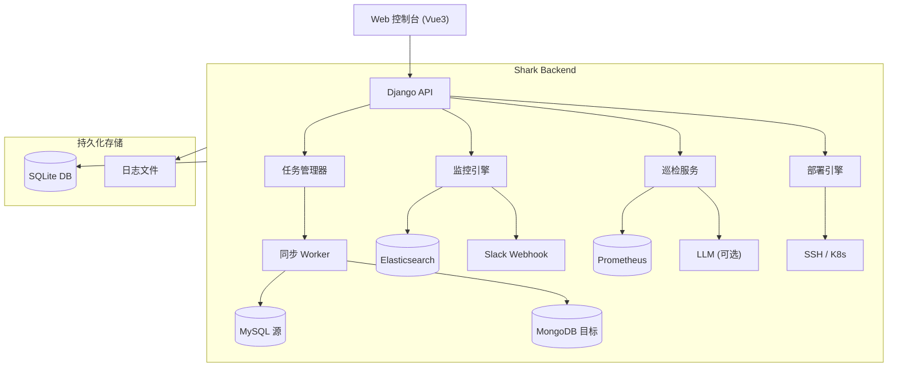

# Shark Platform

[](https://www.python.org/)
[](https://www.djangoproject.com/)
[](https://vuejs.org/)
[](https://element-plus.org/)
[](https://www.docker.com/)

**Shark Platform** 
想到啥写啥的平台，现有功能数据同步mysql--->mongo， 日志监控，ai巡检 采集端是 Prometheus，服务部署。

## ✨ 核心功能

### 1. 🔄 数据同步 (MySQL → MongoDB)
Shark Platform 的核心引擎，支持高可靠的数据传输。
*   **全量同步**: 采用并行预取与批量写入技术，高效迁移历史数据。
*   **增量同步 (CDC)**: 基于 Binlog (Row Format) 实时捕获数据变更，实现毫秒级延迟。
*   **断点续传**: 自动记录同步位点，服务重启或故障恢复后可无缝续传。
*   **数据一致性**: 支持 Update-Insert (Upsert) 模式，确保数据最终一致性。

### 2. 🚨 日志监控 (Monitor)
*集成 Elasticsearch 与 Slack，实时守护业务健康。*
*   **实时扫描**: 定时轮询 Elasticsearch 日志数据。
*   **智能告警**: 支持自定义关键词过滤、忽略与仅记录模式。
*   **Slack 集成**: 发现异常立即推送到 Slack 频道，支持聚合消息以防轰炸。
*   **配置化管理**: 所有规则均可在 Web 界面动态调整，无需重启服务。

### 3. 🩺 系统巡检 (Inspection)
*基于 Prometheus 的自动化运维助手。*
*   **指标分析**: 自动拉取 Prometheus 关键指标（CPU、内存、磁盘、QPS等）。
*   **AI 辅助**: (可选) 集成 LLM (如 Ark/OpenAI)，对巡检数据进行智能分析并生成自然语言报告。
*   **历史归档**: 自动保存每日、每周、每月巡检报告，便于回溯。

### 4. 🛠️ 运维部署 (Deploy)
*   **多环境支持**: 支持主机 (SSH)、Docker、K8s 等多种部署目标。
*   **配置管理**: 统一管理服务器连接信息与部署配置文件。

---

## 🏗 平台架构

平台采用 **前后端分离** 架构：



*   **前端**: Vue 3 + Element Plus，提供响应式、现代化的用户界面。
*   **后端**: Django REST Framework (DRF)，提供稳健的 API 服务。
*   **数据层**: 
    *   **SQLite**: 存储平台自身的配置、任务状态与用户信息 (无需额外部署 MySQL)。
    *   **MySQL & MongoDB**: 业务数据源与目标。

---

## 🔌 接口文档与路由说明

Shark Platform 提供了一套完整的 RESTful API，用于管理平台的所有资源。以下是主要的路由结构说明。

### 1. 核心路由 (`shark_platform/urls.py`)

| 路径前缀 | 说明 |
| :--- | :--- |
| `/` | 任务管理与连接管理 (根路由) |
| `/monitor/` | 监控模块路由 |
| `/inspection/` | 巡检模块路由 |
| `/deploy/` | 部署模块路由 |
| `/accounts/` | 用户认证 (登录/登出) |
| `/admin/` | Django 后台管理 |

### 2. 任务与连接 (`tasks/urls.py`)

| 方法 | 路由 | 说明 |
| :--- | :--- | :--- |
| **Connections** | | |
| `GET/POST` | `/connections` | 获取连接列表 / 创建连接 |
| `GET/DELETE` | `/connections/<id>` | 获取连接详情 / 删除连接 |
| `POST` | `/connections/test` | 测试连接可用性 |
| **Tasks** | | |
| `GET` | `/tasks/list` | 获取所有任务列表 |
| `GET` | `/tasks/status` | 获取所有任务运行状态 |
| `POST` | `/tasks/start` | 启动任务 |
| `POST` | `/tasks/stop/<id>` | 停止任务 |
| `POST` | `/tasks/delete/<id>` | 删除任务 |
| `GET` | `/tasks/logs/<id>` | 查看任务日志 |

### 3. 监控模块 (`monitor/urls.py`)

| 方法 | 路由 | 说明 |
| :--- | :--- | :--- |
| `GET/POST` | `/monitor/config` | 获取 / 更新全局监控配置 |
| `GET` | `/monitor/status` | 获取监控引擎运行状态 |
| `POST` | `/monitor/start` | 启动监控服务 |
| `POST` | `/monitor/stop` | 停止监控服务 |

### 4. 巡检模块 (`inspection/urls.py`)

| 方法 | 路由 | 说明 |
| :--- | :--- | :--- |
| `GET/POST` | `/inspection/config` | 获取 / 更新巡检配置 |
| `POST` | `/inspection/run` | 手动触发一次巡检 |
| `GET` | `/inspection/history` | 获取历史巡检报告列表 |
| `GET` | `/inspection/report/<id>` | 获取指定报告详情 |

### 5. 部署模块 (`deploy/urls.py`)

| 方法 | 路由 | 说明 |
| :--- | :--- | :--- |
| `GET` | `/deploy/servers` | 获取服务器列表 |
| `POST` | `/deploy/run` | 创建并开始一个部署流程 |
| `GET` | `/deploy/plans/<id>` | 获取部署计划详情 |
| `POST` | `/deploy/execute/<id>` | 执行部署计划 |

---

## 🚀 部署指南

我们强烈推荐使用 **Docker Compose** 进行部署，这是最简单、最快捷的方式。

### 前置要求
*   Docker & Docker Compose
*   MySQL 源数据库 (需开启 Binlog ROW 模式)
*   MongoDB 目标数据库

### 1. 快速启动
只需一行命令即可启动完整环境：

```bash
docker-compose up -d --build
```

该命令将启动：
*   `syncer_app`: Shark Platform 主应用 (端口 8000)
*   `mysql_source`: 测试用 MySQL (端口 3317)
*   `mongo1/2/3`: 测试用 MongoDB 副本集 (端口 27018-27020)

### 2. 访问控制台
启动成功后，打开浏览器访问：

👉 **[http://localhost:8000/](http://localhost:8000/)**

*   **默认账号**: `admin`
*   **默认密码**: `admin`

### 3. 数据持久化
平台所有配置和状态均持久化在本地文件系统中，重启不会丢失：
*   `./state`: 存储 SQLite 数据库 (包含所有配置与任务状态)
*   `./logs`: 存储应用运行日志

---

## 📖 使用手册

### 第一步：配置数据源
1.  登录控制台，进入 **"Data Sources"**。
2.  点击 **"New Connection"**。
3.  分别添加 MySQL 源库和 MongoDB 目标库的连接信息。

### 第二步：创建同步任务
1.  进入 **"Task Management"**。
2.  点击 **"New Task"**。
3.  选择源 (MySQL) 和目标 (MongoDB)。
4.  配置同步表映射 (Table Map) 与主键 (PK)。
5.  保存并启动任务。

### 第三步：配置监控 (可选)
1.  进入 **"Log Monitoring"**。
2.  配置 Elasticsearch 连接信息与 Slack Webhook。
3.  设置告警关键词，启用监控。

---

## ⚙️ 开发环境设置

如果您想参与开发或进行二次开发：

1.  **克隆代码**
    ```bash
    git clone https://github.com/your-org/shark-platform.git
    cd shark-platform
    ```

2.  **创建虚拟环境**
    ```bash
    python -m venv venv
    source venv/bin/activate  # Linux/Mac
    # venv\Scripts\activate   # Windows
    ```

3.  **安装依赖**
    ```bash
    pip install -r requirements.txt
    ```

4.  **初始化数据库**
    ```bash
    python manage.py migrate
    python manage.py createsuperuser
    ```

5.  **启动开发服务**
    ```bash
    python manage.py runserver 0.0.0.0:8000
    ```

---

## 🔒 安全说明

*   **生产环境密钥**: 请务必在生产环境中修改 `DJANGO_SECRET_KEY` 环境变量。
*   **调试模式**: 生产环境请确保 `DEBUG=False` (Docker 部署默认已关闭)。
*   **认证**: 建议在反向代理层 (如 Nginx) 配置 HTTPS。

---

## 📄 许可证

本项目仅供个人学习与研究使用。
