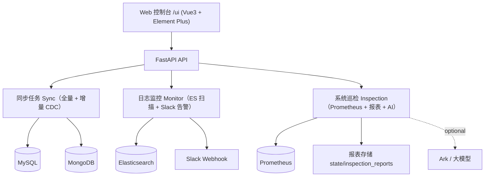
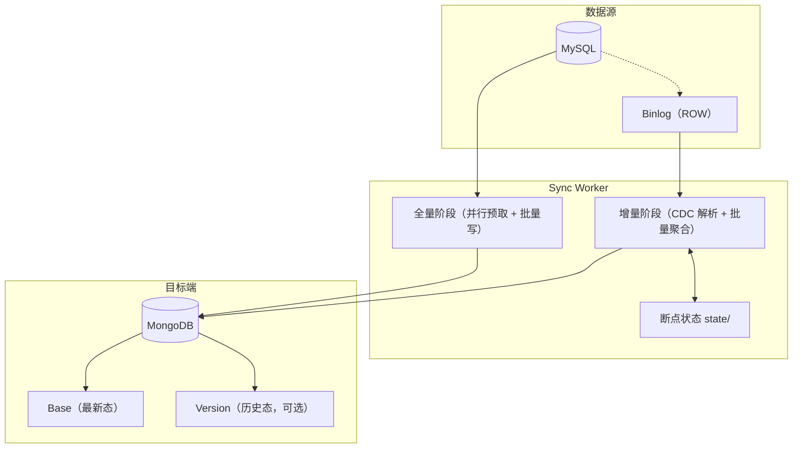
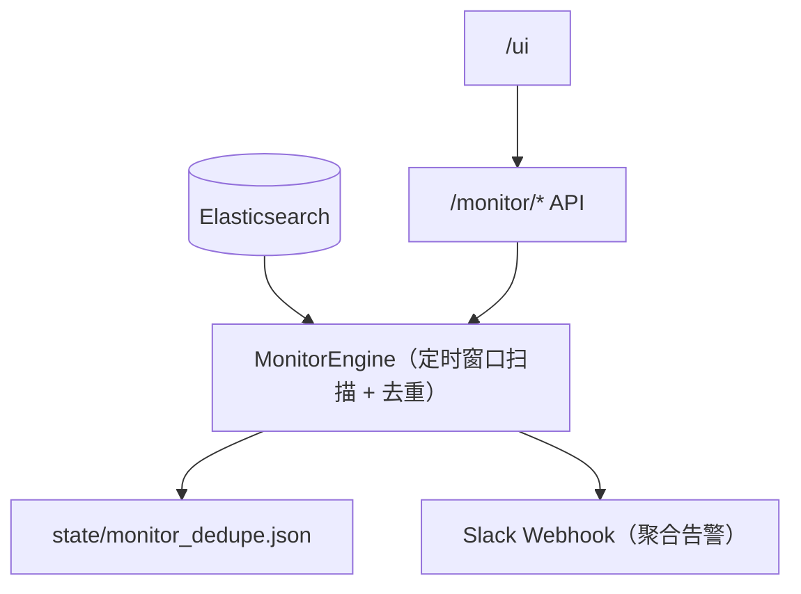
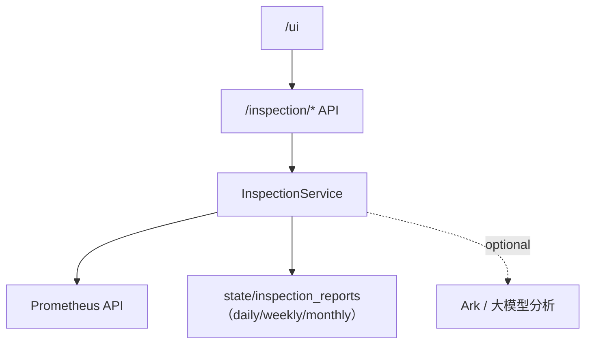

# Shark Platform（同步 / 监控告警 / 巡检）

[](https://github.com/your-org/mysql-to-mongo)
[](https://www.python.org/)
[](https://www.mysql.com/)
[](https://www.mongodb.com/)
[](https://www.docker.com/)

Shark Platform 自己摸索学习的工具：现在主要功能**MySQL → MongoDB** 数据同步， **日志监控告警** 与 **系统巡检**，并通过Web 控制台进行配置与观测。

---

## 🧱 平台总览架构



---

## 🌐 入口与文档

| 入口 | 说明 |
| --- | --- |
| `/ui/index.html` | 平台 Web 控制台 |
| `/openapi.json` | OpenAPI 规范（机器可读） |
| `/docs` | 文档页（优先 Swagger UI；资源缺失时自动降级为简化页） |

---

## 🔁 同步模块（MySQL → MongoDB）

### 架构



### API（简略）

| 方法 | 路径 | 说明 |
| --- | --- | --- |
| `GET` | `/tasks/list` | 列出已保存的同步任务 |
| `GET` | `/tasks/status` | 获取所有任务状态（包含 monitor 虚拟任务） |
| `GET` | `/tasks/status/{task_id}` | 获取指定任务状态（支持 ETag） |
| `POST` | `/tasks/start` | 以完整配置启动任务（SyncTaskRequest） |
| `POST` | `/tasks/start_with_conn_ids` | 以已保存连接 id 启动任务（推荐给 UI） |
| `POST` | `/tasks/start_existing/{task_id}` | 从磁盘配置恢复并启动任务 |
| `POST` | `/tasks/stop/{task_id}` | 强制停止任务 |
| `POST` | `/tasks/stop_soft/{task_id}` | 软停止任务（更温和） |
| `POST` | `/tasks/reset/{task_id}` | 重置任务状态（清理断点） |
| `POST` | `/tasks/reset_and_start/{task_id}` | 重置并立即启动 |
| `POST` | `/tasks/delete/{task_id}` | 删除任务配置 |
| `GET` | `/tasks/logs/{task_id}` | 分页读取任务日志 |
| `GET` | `/tasks/logs/{task_id}/download` | 下载任务日志（支持关键词与时间过滤） |

---

## 🚨 监控告警模块（Elasticsearch → Slack）

### 架构



### API（简略）

| 方法 | 路径 | 说明 |
| --- | --- | --- |
| `GET` | `/monitor/status` | 获取监控引擎状态（已脱敏敏感字段） |
| `GET` | `/monitor/config` | 获取监控配置（返回空密码，要求保存时重新填写） |
| `POST` | `/monitor/config` | 更新配置并重启监控 |
| `POST` | `/monitor/start` | 启动监控 |
| `POST` | `/monitor/stop` | 停止监控 |

---

## 🩺 巡检模块（Prometheus → 报表 + AI）

### 架构



### API（简略）

| 方法 | 路径 | 说明 |
| --- | --- | --- |
| `POST` | `/inspection/run` | 触发巡检：拉取 targets/alerts，生成报表并落盘 |
| `GET` | `/inspection/reports` | 列出报表 id（按 daily/weekly/monthly） |
| `GET` | `/inspection/reports/{report_id}` | 获取报表详情 |

---

## 🔌 数据源与元信息管理

| 方法 | 路径 | 说明 |
| --- | --- | --- |
| `GET` | `/connections` | 列出连接（不返回密码） |
| `POST` | `/connections` | 保存连接（要求密码） |
| `GET` | `/connections/{conn_id}` | 获取连接（不返回密码） |
| `DELETE` | `/connections/{conn_id}` | 删除连接 |
| `POST` | `/connections/test` | 测试连接可用性 |
| `POST` | `/mysql/databases` | 按连接参数列出 MySQL 数据库 |
| `POST` | `/mysql/databases_by_id/{conn_id}` | 按连接 id 列出 MySQL 数据库 |
| `POST` | `/mysql/tables` | 按连接参数列出 MySQL 表 |
| `POST` | `/mysql/tables_by_id/{conn_id}` | 按连接 id 列出 MySQL 表 |

---

## 🛠 支持环境 (Supported Environments)

| 组件 | 版本要求 | 说明 |
| :--- | :--- | :--- |
| **Python** | 3.8+ | 推荐使用 Python 3.9 或更高版本 |
| **MySQL** | 5.7, 8.0+ | 必须开启 Binlog (`binlog_format=ROW`) |
| **MongoDB** | 4.4+ | 推荐使用 Replica Set 模式以支持事务 |
| **Browser** | Chrome/Edge/Firefox | 需要支持 ES6+ 的现代浏览器 |

---

## 🚀 快速开始 (Quick Start)

### 方式一：Docker 部署（推荐）

1.  **构建镜像**
    ```bash
    docker build -t mysql-to-mongo:v1.1.0 .
    ```

2.  **启动服务**
    ```bash
    # 创建必要的挂载目录
    mkdir -p configs state connections configs_keys logs

    # 启动容器
    docker run -d \
      --name mysql-to-mongo \
      -p 8000:8000 \
      -e PYTHONUNBUFFERED=1 \
      -e TZ=Asia/Shanghai \
      -v $(pwd)/configs:/app/configs \
      -v $(pwd)/state:/app/state \
      -v $(pwd)/connections:/app/connections \
      -v $(pwd)/configs_keys:/app/configs_keys \
      -v $(pwd)/logs:/app/logs \
      --restart unless-stopped \
      mysql-to-mongo:v1.1.0
    ```

### 方式二：本地源码运行

1.  **克隆项目**
    ```bash
    git clone https://github.com/your-org/mysql-to-mongo.git
    cd mysql-to-mongo
    ```

2.  **安装依赖**
    ```bash
    pip install -r requirements.txt
    ```

3.  **启动服务**
    ```bash
    uvicorn app.main:app --host 0.0.0.0 --port 8000
    ```

4.  **访问管理后台**
    打开浏览器访问:
    - Web 控制台: `http://localhost:8000/ui/index.html`
    - OpenAPI: `http://localhost:8000/openapi.json`
    - API 文档: `http://localhost:8000/docs`

---

## ⚙️ 性能调优 (Performance Tuning)

针对亿级数据量的同步需求，系统提供了多项性能与资源控制参数，您可以在任务配置文件中进行调整：

| 参数 | 默认值 | 说明 |
| :--- | :--- | :--- |
| `full_sync_fast_insert_if_empty` | `true` | 全量同步时，如果目标集合为空，直接使用 `insert_many` 跳过 Upsert 检查，大幅提升写入速度。 |
| `prefetch_queue_size` | `2` | 全量同步的 MySQL 读取预取队列大小，实现读写并行。资源充足时可调大至 3-5。 |
| `rate_limit_enabled` | `true` | 是否启用自适应速率限制器。 |
| `max_load_avg_ratio` | `0.8` | 触发限速的系统负载阈值（LoadAvg / CPU核心数）。建议设置为 0.6-0.8。 |
| `min_sleep_ms` | `5` | 触发限速时的最小休眠时间（毫秒）。 |
| `max_sleep_ms` | `200` | 触发限速时的最大休眠时间（毫秒），系统会根据负载超出的程度在此范围内动态调整。 |
| `mongo_compressors` | `["snappy", "zlib"]` | MongoDB 网络传输压缩算法，有效降低带宽占用。 |

### 🛡️ 自适应速率限制器详解 (Adaptive Rate Limiter)

为了防止同步任务在业务高峰期占用过多的 CPU 或 I/O 资源，系统内置了智能限速机制。

**工作原理：**
1.  **系统负载监控**: 实时采集操作系统的 Load Average (1分钟均值)。
2.  **阈值判断**: 计算 `Current Load / CPU Cores`，若超过配置的 `max_load_avg_ratio` (默认 0.8)，则判定为系统过载。
3.  **写入延迟反馈**: 监控 MongoDB 的写入延迟（Moving Average），若延迟显著升高，也会触发限速。
4.  **动态休眠**: 一旦触发限速，同步线程会在每批次写入后自动休眠。休眠时间根据负载超出的程度在 `min_sleep_ms` 到 `max_sleep_ms` 之间线性增加。

**优化建议：**
*   **资源敏感型环境**: 将 `max_load_avg_ratio` 调低至 `0.5` - `0.6`。
*   **追求极致速度**: 若运行在专用同步机器上，可将 `rate_limit_enabled` 设置为 `false` 关闭限速。


---

## ⚙️ 配置说明 (Configuration)

### MySQL 配置要求
MySQL 必须开启 Binary Log 并设置为 ROW 模式：
```ini
[mysqld]
server_id = 1
log_bin = mysql-bin
binlog_format = ROW
binlog_row_image = FULL
```

### 任务配置示例
在 API 中创建任务或直接修改 JSON 配置文件：
```json
{
  "task_id": "task_001",
  "mysql_conf": {
    "host": "127.0.0.1",
    "port": 3306,
    "user": "root",
    "password": "password",
    "database": "source_db",
    "use_ssl": true
  },
  "mongo_conf": {
    "host": "127.0.0.1",
    "port": 27017,
    "user": "admin",
    "password": "password",
    "database": "target_db",
    "auth_source": "admin"
  },
  "table_map": {
    "users": "users",
    "orders": "orders"
  },
  "pk_field": "id",
  "update_insert_new_doc": true,
  "delete_mark_only_base_doc": true,
  "auto_discover_new_tables": true
}
```

---

## 📂 目录结构 (Project Structure)

```text
mysql_to_mongo/
├── app/
│   ├── main.py                  # FastAPI 应用入口
│   ├── api/                     # REST API 路由与模型
│   ├── core/                    # 核心组件 (Config, Logging, State)
│   ├── sync/                    # 同步引擎核心代码
│   │   ├── worker.py            # 同步工作线程 (Full + CDC)
│   │   ├── task_manager.py      # 任务管理
│   │   ├── mysql_introspector.py# MySQL 表结构解析
│   │   └── mongo_writer.py      # MongoDB 写入封装
│   ├── monitor/                 # 日志监控与告警
│   └── inspection/              # 系统巡检与报表
├── configs/                     # 任务配置文件存储
├── state/                       # 同步状态(位点)存储
├── static/                      # 前端 UI 资源
│   ├── index.html               # 单页应用入口
│   └── vendor/                  # 第三方库
├── Dockerfile                   # Docker 构建文件
└── requirements.txt             # Python 依赖列表
```

---

## 📄 许可证 (License)
个人学习使用
