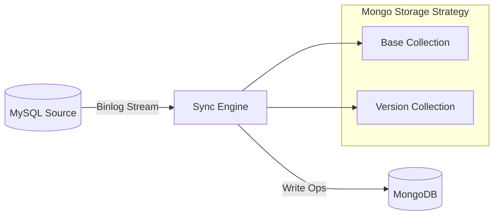

# MySQL to MongoDB 企业级数据同步服务

[](https://www.python.org/downloads/)
[](https://www.docker.com/)
[](LICENSE)

这是一个高性能、高容错的 **MySQL 到 MongoDB 实时数据同步服务**，专为金融级审计系统与数据湖构建。支持 **全量同步**、**Binlog 增量同步（CDC）**、**数据多版本控制** 以及 **无损软删除**。

本服务采用 **Append-Only（仅追加）** 架构设计，确保源端 UPDATE/DELETE 操作绝不篡改 MongoDB 中的历史快照，完美满足审计溯源与时间旅行查询（Time-Travel Query）需求。

---

## ✅ 支持版本 (Compatibility)

| 组件 | 支持版本 | 说明 |
| :--- | :--- | :--- |
| **MySQL** | 5.7, 8.0, 8.4 (LTS) | 必须开启 Binlog (`binlog_format=ROW`) |
| **MongoDB** | 4.4, 5.0, 6.0, 7.0+ | 建议使用副本集 (Replica Set) 或分片集群 |
| **Python** | 3.9+ | 基础运行环境 |
| **Docker** | 20.10+ | 推荐部署方式 |

---

## 🚀 核心特性

- **双模同步引擎**:
  - **全量同步 (Full Sync)**: 基于游标的高效批量导出，支持断点续传。
  - **增量同步 (CDC)**: 实时解析 MySQL Binlog (ROW 模式)，实现毫秒级延迟。
- **数据一致性与安全**:
  - **高精度数值**: 全程使用 `Decimal128` 处理金额字段，杜绝浮点数精度丢失。
  - **写入幂等性**: 自动抑制 `E11000` 重复键错误，确保“至少一次”投递不导致数据崩溃。
  - **故障恢复**: 自动持久化 Binlog 位点，重启后自动无缝续传。
- **审计与溯源 (Append-Only)**:
  - **基础文档不可变**: Base Collection 仅存储初始快照，后续 UPDATE/DELETE 绝不修改原文档。
  - **版本链 (Versioning)**: 每次 UPDATE 生成一条全新的 Version 文档，完整记录变更前后的数据快照。
  - **墓碑机制 (Tombstone)**: DELETE 操作仅追加一条“删除标记”文档，实现物理留痕、逻辑删除。
- **企业级安全**:
  - **配置加密**: 数据库账号密码在落盘前自动使用 **AES-GCM (256-bit)** 加密。
  - **密钥隔离**: 每个同步任务自动生成独立密钥 (`./configs_keys/`)，杜绝明文泄露。

---

## 🏗 系统架构

### 数据流向



### 存储模型设计

1. **Base Document (基准快照)**
   - 来源：全量同步阶段 或 首次 INSERT。
   - 标识：`_id` = `MySQL 主键`。
   - 特性：**不可变 (Immutable)**，作为历史回溯的基准点。

2. **Version Document (历史版本)**
   - 来源：UPDATE 事件。
   - 结构：`_id` (New ObjectId), `_base_id` (关联 Base), `_op` ("update"), `data` (行快照)。
   - 作用：构建完整的数据变更时间轴。

3. **Tombstone Document (删除墓碑)**
   - 来源：DELETE 事件。
   - 结构：`_id` (New ObjectId), `_base_id` (关联 Base), `_op` ("delete"), `deleted_at`。
   - 作用：保留删除痕迹，支持数据恢复与审计。

---

## 🛠 快速部署

### 1. 启动服务 (Docker Compose)

```bash
# 克隆项目
git clone <repo_url>
cd mysql-to-mongo

# 启动服务集群
docker-compose up -d --build
```

### 2. 验证状态
- **API 文档**: [http://localhost:8000/docs](http://localhost:8000/docs)
- **MongoDB**: `mongodb://localhost:27018`

### 3. 持久化目录说明
务必妥善保管以下目录：
- `./configs`: 存储 **加密后** 的任务配置文件。
- `./configs_keys`: 存储任务对应的 **解密密钥** (🔴 **核心机密，请备份**)。
- `./state`: 存储 Binlog 同步位点，用于断点续传。

---

## 🔒 安全配置与任务管理

所有通过 API 提交的数据库凭据均会在内存中即时加密，磁盘上仅存储密文。

### 创建同步任务

**POST** `/tasks/start`

```json
{
  "task_id": "trade_order_sync",
  "mysql_conf": {
    "host": "mysql_source",
    "port": 3306,
    "user": "root",
    "password": "strong_password",
    "database": "order_db"
  },
  "mongo_conf": {
    "host": "mongo1",
    "port": 27017,
    "user": "root",
    "password": "root",
    "database": "data_lake",
    "auth_source": "admin"
  },
  "table_map": {
    "t_orders": "orders_collection"
  },
  "pk_field": "id",
  
  // 核心配置：开启追加模式
  "delete_append_new_doc": true,
  "update_insert_new_doc": true,
  
  // 自动表结构发现
  "auto_discover_new_tables": true
}
```

---

## 🧩 目录结构

```text
.
├── app/
│   ├── api/                 # REST API 接口层
│   ├── core/                # 核心组件 (加密, 配置管理, 日志)
│   ├── sync/                # 同步引擎
│   │   ├── worker.py        # 主同步进程 (Full + Inc Loop)
│   │   ├── mongo_writer.py  # 批量写入与错误抑制处理
│   │   └── convert.py       # 类型转换 (Decimal/Date)
│   └── main.py              # 服务入口
├── configs/                 # [持久化] 加密任务配置
├── configs_keys/            # [持久化] 任务密钥
├── state/                   # [持久化] Binlog 位点
├── Dockerfile               # 生产级镜像构建文件
└── docker-compose.yml       # 本地开发编排
```

---

## ⚠️ 运维指南

1. **任务恢复**:
   - 服务重启时，会自动加载 `configs/` 下的任务并解密，读取 `state/` 位点自动恢复同步。
   - **强制重跑全量**: 停止任务后，删除 `state/<task_id>.json` 并重启即可。

2. **Schema 变更**:
   - 支持 MySQL 新增列的自动识别与同步 (需开启 `unknown_col_fix_enabled`)。
   - 支持新表的自动发现与同步 (需开启 `auto_discover_new_tables`)。

3. **日志监控**:
   - 查看实时日志: `docker logs -f syncer_app`
   - **注意**: `E11000` (Duplicate Key) 错误会被视为幂等成功而在日志中抑制，这是正常行为。

---

## 📜 开源协议

MIT License. 详情请参阅 [LICENSE](LICENSE) 文件。
