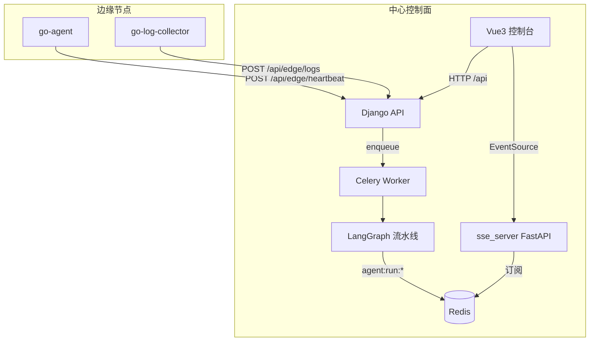
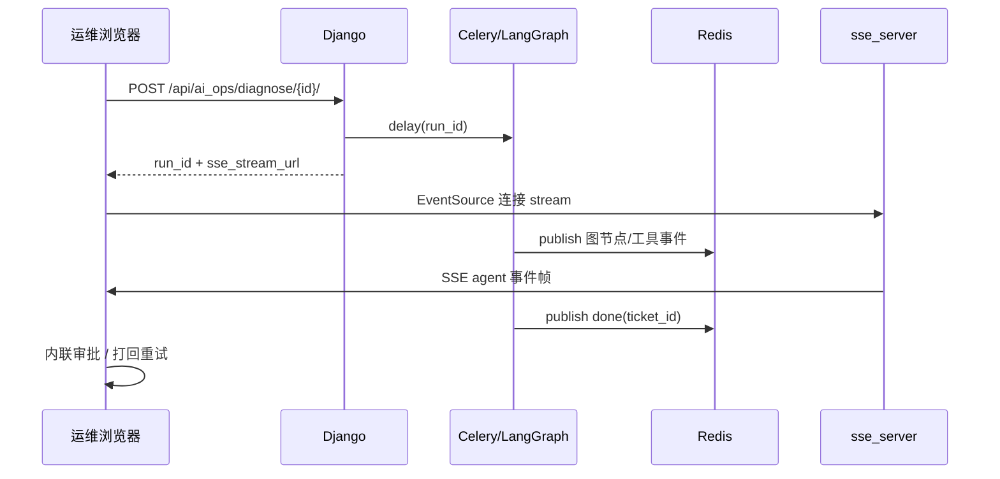

# shark-aiops

面向云原生的 **大规模智能运维枢纽**：**中心控制面**（Django + Celery + LangGraph + SSE + Vue3）编排 **分布式 Go 边缘探针**（系统指标与日志批次上报），形成「中心大脑 + 边缘感知」拓扑。

---

## 平台定位

| 维度 | 说明 |
|------|------|
| **中心（Center）** | 告警与工单模型、LangGraph 诊断流水线、Redis 事件总线、独立 **SSE** 服务向浏览器推送「思维流」 |
| **边缘（Edge）** | **go-agent** 周期性上报主机指标；**go-log-collector** 批量推送日志行，供后续大盘/检索管道消费 |
| **人机闭环** | 审批 **打回** 携带理由触发 **Reflect & Retry**：新 `run_id` + 新 SSE 地址，前端无刷新切换流式时间线 |

---

## 架构总览

### 逻辑拓扑（ASCII）

```
                         ┌──────────────────────────────────────────┐
                         │            中心控制面（本仓库）           │
                         │  Vue3 SPA ──► Nginx ──► Django /api/*   │
                         │       ▲                    │             │
                         │       │ SSE 订阅            │ Celery      │
                         │       │                    ▼             │
                         │       └──────── Redis Pub/Sub ◄─────────┤
                         │                    ▲                     │
                         │            sse_server (FastAPI)         │
                         └────────────────────┼─────────────────────┘
                                              │
     ┌────────────────────────────────────────┼────────────────────────────────┐
     │                    │                   │                                │
┌────▼────┐        ┌─────▼─────┐      ┌──────▼──────┐                 ┌───────▼───────┐
│go-agent │        │go-log-     │      │  Prometheus │                 │  Alertmanager │
│指标心跳  │        │collector  │      │  / K8s API  │                 │  Webhook 等   │
└─────────┘        └───────────┘      └─────────────┘                 └───────────────┘
   边缘节点            边缘节点            只读外部依赖                      事件入口（可选）
```

### 数据与控制流（Mermaid）


```mermaid
flowchart TB
  subgraph Center["中心控制面"]
    UI[Vue3 控制台]
    DJ[Django API]
    CE[Celery Worker]
    LG[LangGraph 流水线]
    RD[(Redis)]
    SSE[sse_server FastAPI]
  end
  subgraph Edge["边缘节点"]
    GA[go-agent]
    GL[go-log-collector]
  end
  UI -->|HTTP /api| DJ
  UI -->|EventSource| SSE
  DJ -->|enqueue| CE
  CE --> LG
  LG -->|agent:run:*| RD
  SSE -->|订阅| RD
  GA -->|POST /api/edge/heartbeat| DJ
  GL -->|POST /api/edge/logs| DJ
```

### 诊断与 SSE 时序（简图）


```mermaid
sequenceDiagram
  participant U as 运维浏览器
  participant D as Django
  participant C as Celery/LangGraph
  participant R as Redis
  participant S as sse_server
  U->>D: POST /api/ai_ops/diagnose/{id}/
  D->>C: delay(run_id)
  D-->>U: run_id + sse_stream_url
  U->>S: EventSource 连接 stream
  C->>R: publish 图节点/工具事件
  S->>U: SSE agent 事件帧
  C->>R: publish done(ticket_id)
  U->>U: 内联审批 / 打回重试
```

---

## 版本与依赖关系

> **原则**：运行时以 **Dockerfile / docker-compose** 与 **requirements.txt、package.json、go.mod** 为准；下表便于评审与升级规划。

### 运行时与容器基镜像

| 组件 | 版本要求 | 说明 |
|------|-----------|------|
| **Python** | **3.9+** | `Dockerfile` 使用 `python:3.9-slim`；LangGraph 等依赖不建议低于 3.9 |
| **Node.js** | **18** | 前端构建阶段 `node:18-slim` |
| **Go** | **≥ 1.22** | `go-agent`、`go-log-collector` 的 `go.mod` |
| **Redis** | **7.x**（推荐） | Compose 默认 `redis:7-alpine`；Celery Broker + Agent 事件共用 |
| **Docker Compose** | **V2** | `docker compose` 子命令 |

### Python 核心栈（节选）

| 依赖 | 约束 | 角色 |
|------|------|------|
| Django | 4.2.11 | Web 框架、ORM、Admin |
| djangorestframework | 3.14.0 | REST API |
| celery | 5.3.6 | 异步任务、LangGraph 触发 |
| redis | ≥5.2,&lt;6 | 客户端；与 Celery broker 协议匹配 |
| langgraph | ≥0.2,&lt;0.3 | 诊断图编排 |
| langchain-core | ≥0.3,&lt;0.4 | LangGraph 配套 |
| langgraph-checkpoint-redis | ≥0.1,&lt;0.2 | 图 Checkpointer（需 **RedisJSON/Search** 或兼容 Redis） |
| fastapi / uvicorn | 见 requirements | **sse_server** 独立进程 |
| sse-starlette | ≥2 | SSE 响应 |

完整列表见根目录 **`requirements.txt`**。

### 前端栈（节选）

| 依赖 | 约束 | 角色 |
|------|------|------|
| vue | ^3.2 | 主框架 |
| vite | ^3.0 | 构建 |
| element-plus | ^2.13 | 组件库（深色主题 + L5 壳层） |
| pinia | ^3.0 | 状态 |
| axios | ^1.13 | HTTP（封装于 `frontend/src/utils/request.ts`） |
| echarts | ~5.5.1 | 指标图（AIOps 页） |

完整列表见 **`frontend/package.json`**。

### 边缘探针

| 模块 | Go 版本 | 主要依赖 |
|------|---------|----------|
| go-agent | 1.22 | gopsutil/v4（主机指标） |
| go-log-collector | 1.22 | 标准库 + HTTP 客户端 |

---

## 仓库结构（摘）

```
shark-Platform/
├── shark_platform/       # Django 工程（settings、urls、celery）
├── api/                  # 健康检查、认证、用户角色、边缘 ingest
├── ai_ops/               # 告警、工单、LangGraph、任务、SSE 事件发布
├── core/                 # 工单闸门等横切能力
├── frontend/             # Vue3 控制台（L5 深色 UI）
├── go-agent/             # 边缘系统探针
├── go-log-collector/     # 边缘日志采集
├── sse_server.py         # 独立 SSE 服务入口
├── docker-compose.yml    # 中心一键编排
├── Dockerfile            # 多阶段：前端构建 + Python 运行镜像
├── requirements.txt
├── .env.example
└── docs/
    └── DEPLOYMENT.md     # 【部署文档】详见该文件
```

---

## 快速开始（中心）

```bash
cp .env.example .env   # 按需修改
docker compose up -d --build
```

- 控制台：**http://localhost:8000**
- SSE：**http://localhost:8010**（浏览器访问时请将 **`AGENT_SSE_PUBLIC_BASE`** 设为宿主机可达地址，例如 `http://localhost:8010`）
- 默认管理员：**admin / admin**（务必修改）

**更完整的步骤、环境变量、边缘部署与排障** → 请阅读 **[docs/DEPLOYMENT.md](./docs/DEPLOYMENT.md)**。

---

## 核心机制摘要

1. **L5 流式思维树（SSE）**  
   诊断接口返回 `sse_stream_url` 后，前端通过 **EventSource** 消费 `agent` 事件：`graph_node`、`tool_start` / `tool_end`、`operator_context`、`human_feedback`、`done` 等，用于白盒展示智能体执行过程。

2. **人工干预：Reflect & Retry**  
   待审工单 **打回** 时提交理由；后端将工单置为拒绝并 **再起一轮 LangGraph**，响应中带 **`new_run_id`** 与 **`new_sse_stream_url`**，前端递增 key 重新挂载流组件，实现「反馈即重跑」。

---

## API 速查

| 方法 | 路径 | 说明 |
|------|------|------|
| GET | `/api/system/health` | 存活探测 |
| POST | `/api/auth/login` | 登录（Session） |
| GET | `/api/me` | 当前用户与权限 |
| POST | `/api/ai_ops/diagnose/<incident_id>/` | 触发 LangGraph |
| POST | `/api/edge/heartbeat` | 边缘探针心跳（需 Token） |
| POST | `/api/edge/logs` | 边缘日志批次（需 Token） |

---

## 许可证

以贵司仓库策略为准。
