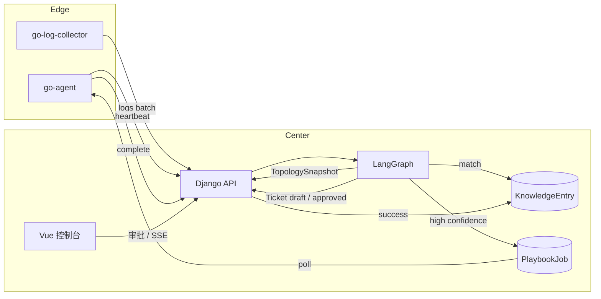

# AIOps Platform

**AI 驱动的 L4 级云原生运维系统——让大模型接管监控与排障。**

中心控制面以 **Django + Celery + LangGraph + Redis SSE** 编排闭环；边缘以 **纯 Go 探针** 执行心跳、日志脱敏上报与 **Playbook 自愈脚本**。目标形态是「AI 即运维（AI as the Operator）」：感知、诊断、决策、执行与学习在同一套数据面内贯通。

---

## 架构解析

### Center（本仓库）

| 能力 | 说明 |
|------|------|
| **API / ORM** | 告警、工单、经验库、拓扑快照、Playbook 任务模型 |
| **Celery** | 异步触发 LangGraph 流水线 |
| **LangGraph** | `感知指标 → 推断拓扑 → 经验库匹配 → 因果诊断 → 落库工单/自愈`；置信度 ≥ `AIOPS_AUTO_HEAL_CONFIDENCE_THRESHOLD`（默认 0.95）且存在可执行 Playbook 时，生成**已批准**工单并创建 **PlaybookJob** 下发边缘 |
| **SSE** | 独立 `sse_server` 通过 Redis 向浏览器推送图节点与工具事件 |
| **边缘入口** | `POST /api/edge/*`（需 `X-Shark-Edge-Token` = 中心 `SHARK_EDGE_TOKEN`） |

### Edge（`go-agent` / `go-log-collector`）

| 探针 | 职责 |
|------|------|
| **go-agent** | 周期 **心跳**（主机摘要）；轮询 **`GET /api/edge/playbooks?node_id=`** 领取任务，**本地 `/bin/sh -c` 执行**脚本后 **`POST .../complete`** 回传；成功时中心将工单置为已执行并**沉淀经验库** |
| **go-log-collector** | stdin 或单文件 tail；**边缘正则脱敏**（邮箱、卡号、Bearer 等，可扩展 `SHARK_AIOPS_REDACT_REGEX`）；按 `SHARK_AIOPS_LOG_SEVERITY` 过滤关键行后批量上报 |

### 业务闭环（拓扑感知 → 工单 → 审批 → 经验库 → 自愈）


```mermaid
flowchart LR
  subgraph Edge
    GA[go-agent]
    GL[go-log-collector]
  end
  subgraph Center
    DJ[Django API]
    LG[LangGraph]
    KB[(KnowledgeEntry)]
    PB[(PlaybookJob)]
    UI[Vue 控制台]
  end
  GL -->|logs batch| DJ
  GA -->|heartbeat| DJ
  DJ --> LG
  LG -->|TopologySnapshot| DJ
  LG -->|match| KB
  LG -->|Ticket draft / approved| DJ
  LG -->|high confidence| PB
  PB -->|poll| GA
  GA -->|complete| DJ
  DJ -->|success| KB
  UI -->|审批 / SSE| DJ
```

---

## 一键部署（Docker Compose）

```bash
cp .env.example .env   # 设置 SHARK_EDGE_TOKEN、数据库、Redis、AGENT_SSE_PUBLIC_BASE 等
docker compose up -d --build
```

- **控制台**：`http://localhost:8000`（首页为 Bento 概览，`/console` 为运维台）
- **SSE**：默认 `http://localhost:8010`（浏览器可访问时请将 **`AGENT_SSE_PUBLIC_BASE`** 设为宿主机可达地址）
- **默认管理员**：`admin / admin`（生产环境务必修改）

### 中心关键环境变量（摘）

| 变量 | 含义 |
|------|------|
| `SHARK_EDGE_TOKEN` | 边缘探针共享密钥（请求头 `X-Shark-Edge-Token`） |
| `AIOPS_AUTO_HEAL_CONFIDENCE` | 自动批准并下发 Playbook 的置信度阈值（默认 `0.95`） |
| `AIOPS_DEFAULT_PLAYBOOK_NODE` | 与边缘 `SHARK_AIOPS_NODE_ID` 对齐的节点 ID（默认 `default`） |
| `AGENT_SSE_PUBLIC_BASE` | 返回给前端的 SSE 根 URL |

---

## 边缘探针：编译与运行

### go-agent

```bash
cd go-agent && go mod tidy && go build -o aiops-agent .
```

| 变量 | 说明 |
|------|------|
| `SHARK_AIOPS_CENTER_URL` | 中心根 URL，无尾部斜杠 |
| `SHARK_AIOPS_EDGE_TOKEN` | 与中心 `SHARK_EDGE_TOKEN` 一致 |
| `SHARK_AIOPS_NODE_ID` | 与 `AIOPS_DEFAULT_PLAYBOOK_NODE` 对齐，用于拉取 Playbook |
| `SHARK_AIOPS_INTERVAL` | 心跳周期，默认 `30s` |
| `SHARK_AIOPS_PLAYBOOK_POLL` | Playbook 轮询周期，默认 `5s` |

### go-log-collector

```bash
cd go-log-collector && go build -o aiops-log-collector .
```

| 变量 | 说明 |
|------|------|
| `SHARK_AIOPS_LOG_SEVERITY` | `error`（默认）/ `warn` / `all` |
| `SHARK_AIOPS_REDACT_REGEX` | 可选：`pattern@@@replacement` 多条用 `\|\|` 分隔 |

示例：`tail -F /var/log/app.log | SHARK_AIOPS_EDGE_TOKEN=secret ./aiops-log-collector`

---

## API 速查

| 方法 | 路径 | 说明 |
|------|------|------|
| GET | `/api/ai_ops/dashboard/` | Bento 大屏聚合（需登录） |
| POST | `/api/ai_ops/diagnose/<id>/` | 触发 LangGraph |
| GET | `/api/edge/playbooks` | 边缘领取 Playbook（Token） |
| POST | `/api/edge/playbooks/<uuid>/complete` | 边缘回传执行结果 |
| POST | `/api/edge/heartbeat` | 心跳 |
| POST | `/api/edge/logs` | 日志批次 |

---

## 仓库结构（摘）

```
├── shark_platform/     # Django 工程
├── api/                  # 认证、边缘 ingest、Playbook 轮询
├── ai_ops/               # 模型、LangGraph、工单、大屏 API
├── frontend/             # Vue3（概览 + 运维台 + Cmd/Ctrl+K）
├── go-agent/
├── go-log-collector/
├── sse_server.py
├── docker-compose.yml
└── Dockerfile
```

---

## 许可证

以贵司仓库策略为准。
