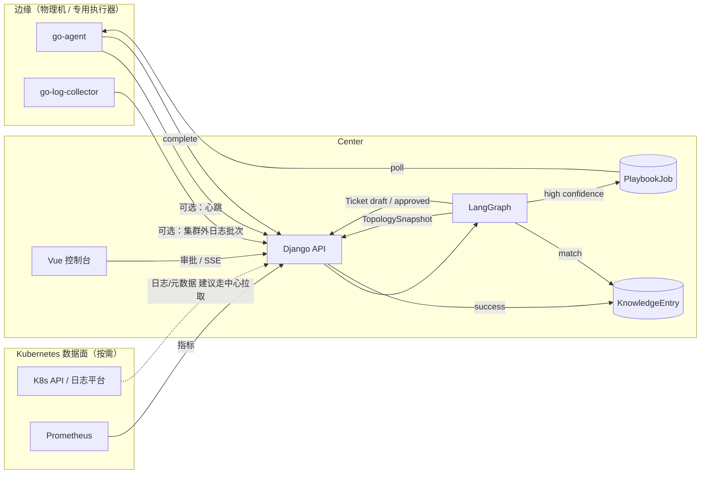

# AIOps Platform

**AI 驱动的 L4 级云原生运维系统——让大模型接管监控与排障。**

中心控制面以 **Django + Celery + LangGraph + Redis SSE** 编排闭环；在 **物理机或隔离网络** 场景下由 **纯 Go 探针** 承担心跳、日志脱敏上报与 **Playbook 自愈脚本**。在 **Kubernetes（云上或本地）** 中，容器与工作负载的指标、日志应优先通过 **集群内 API**（如 Kubernetes API、`kubectl logs` 等价能力、Loki/ES、已部署的 Prometheus）获取，**不必**再为每个业务 Pod 叠加一层「容器内上报」——避免重复与权限扩散。生产环境推荐将 **本平台部署在目标集群内**（同一 VPC / 同一集群），以降低跨网延迟并复用 ServiceAccount 与指标栈。

---

## 环境与部署兼容（物理机 · 云上/本地 K8s · 混合）

| 场景 | 中心部署 | 感知与日志 | Playbook / 自愈 |
|------|-----------|------------|-----------------|
| **仅 K8s 工作负载** | Deployment / Helm 进集群 | `PROMETHEUS_URL` 指向集群内或托管监控；日志走 **K8s API / 日志平台**，而非业务容器内嵌采集器 | 集群内可用 **Job** 或专用 **controller Deployment** 轮询 `GET /api/edge/playbooks`（逻辑 `node_id`），执行 `kubectl` 或脚本 |
| **仅物理机 / VM** | 可 VM 或独立 K8s | **go-agent** 心跳、**go-log-collector** tail 文件/stdin | **go-agent** 拉 Playbook 本地执行 |
| **混合（常见）** | 集群内 | 集群内走 API/指标；集群外机器走 Go 探针 | `AIOPS_DEPLOYMENT_MODE=hybrid`，按节点类型分流 |

环境变量 **`AIOPS_DEPLOYMENT_MODE`**（可选值 `kubernetes` / `hybrid` / `physical` / `unspecified`）用于表达上述形态；**留空时**若进程可见 **`KUBERNETES_SERVICE_HOST`**（标准 K8s 注入），则自动视为 **`kubernetes`**。大屏接口 **`GET /api/ai_ops/dashboard/`** 会返回 `deployment` 字段，便于 UI 与运维文档对齐预期。

---

## 架构解析

### Center（本仓库）

| 能力 | 说明 |
|------|------|
| **API / ORM** | 告警、工单、经验库、拓扑快照、Playbook 任务模型 |
| **Celery** | 异步触发 LangGraph 流水线 |
| **LangGraph** | `感知指标 → 推断拓扑 → 经验库匹配 → 因果诊断 → 落库工单/自愈`；置信度 ≥ `AIOPS_AUTO_HEAL_CONFIDENCE_THRESHOLD`（默认 0.95）且存在可执行 Playbook 时，生成**已批准**工单并创建 **PlaybookJob** 下发边缘 |
| **SSE** | 独立 `sse_server` 通过 Redis 向浏览器推送图节点与工具事件 |
| **边缘入口** | `POST /api/edge/*`（需 `X-Shark-Edge-Token` = 中心 `SHARK_EDGE_TOKEN`） |

### Edge（`go-agent` / `go-log-collector`）— 按需使用

| 探针 | 职责 | 在 K8s 内是否默认需要 |
|------|------|------------------------|
| **go-agent** | 周期 **心跳**（主机摘要）；轮询 Playbook **本地执行**并回传 | **通常不需要**为业务 Pod 安装；仅当需要 **节点级/宿主机视角** 或 **集群外执行点** 时使用 DaemonSet 或 VM 安装 |
| **go-log-collector** | 文件/stdin tail、**边缘脱敏**、批量上报 | **通常不需要**；集群内容器日志优先由 **API 或日志系统** 拉取，避免与平台侧能力重复 |

### 业务闭环（拓扑感知 → 工单 → 审批 → 经验库 → 自愈）


```mermaid
flowchart LR
  subgraph Edge["边缘（物理机 / 专用执行器）"]
    GA[go-agent]
    GL[go-log-collector]
  end
  subgraph Cluster["Kubernetes 数据面（按需）"]
    KAPI[K8s API / 日志平台]
    PROM[Prometheus]
  end
  subgraph Center
    DJ[Django API]
    LG[LangGraph]
    KB[(KnowledgeEntry)]
    PB[(PlaybookJob)]
    UI[Vue 控制台]
  end
  PROM -->|指标| DJ
  KAPI -.->|日志/元数据 建议走中心拉取| DJ
  GL -->|可选：集群外日志批次| DJ
  GA -->|可选：心跳| DJ
  DJ --> LG
  LG -->|TopologySnapshot| DJ
  LG -->|match| KB
  LG -->|Ticket draft / approved| DJ
  LG -->|high confidence| PB
  PB -->|poll| GA
  GA -->|complete| DJ
  DJ -->|success| KB
  UI -->|审批 / SSE| DJ
```

---

## 一键部署（Docker Compose）

```bash
cp .env.example .env
# 编辑 .env：必填 SHARK_AI_API_KEY（DeepSeek）、建议 SHARK_EDGE_TOKEN；线上 Prometheus 填 PROMETHEUS_URL
docker compose up -d --build
# 采集容器内 Nginx 日志：docker compose --profile logs up -d
```

Compose **默认**拉起：**PostgreSQL 16**（Django 主库）、**ClickHouse 24**（访问日志 OLAP，按月分区 + TTL）、Redis、Web、Celery、SSE。

- **控制台**：`http://localhost:8000`（首页为 Bento 概览，`/console` 为运维台）
- **SSE**：默认 `http://localhost:8010`（浏览器可访问时请将 **`AGENT_SSE_PUBLIC_BASE`** 设为宿主机可达地址）
- **PostgreSQL**：容器内 `postgres:5432`，库名默认 `shark`（用户/密码见 compose 环境变量）
- **ClickHouse HTTP**：宿主机 `8123`，库名默认 `shark_obs`；摄取在 **`OBSERVABILITY_OLAP_MODE=mirror|analytics`** 时双写 PG + CH
- **默认管理员**：`admin / admin`（生产环境务必修改）

**本地仅用 SQLite（不用 Compose 数据库）**：不设 `POSTGRES_HOST` 时 `shark_platform/db_config.py` 仍回退 SQLite（`state/db.sqlite3`）；此时请勿对 Web 注入 `POSTGRES_HOST`。

### 可观测性 OLAP 模式 `OBSERVABILITY_OLAP_MODE`

| 值 | 行为 |
|----|------|
| `off` | 仅 PostgreSQL/SQLite ORM，不写 ClickHouse |
| `mirror` | 双写 PG + CH；**大屏聚合仍读 PG**（CH 供外部 BI / 后续分析） |
| `analytics` | 双写；**聚合与 compare_windows 优先 ClickHouse**，失败回退 ORM |

相关环境变量：`CLICKHOUSE_HOST`、`CLICKHOUSE_PORT`、`CLICKHOUSE_DATABASE`、`CLICKHOUSE_USER`、`CLICKHOUSE_PASSWORD`。

**PostgreSQL 表分区**：Django migration 仍为单表；超大规模时可参考 `observability/sql/README.md` 由 DBA 做原生 RANGE 分区（与 ClickHouse 自动月分区独立）。

### 中心关键环境变量（摘）

| 变量 | 含义 |
|------|------|
| `SHARK_EDGE_TOKEN` | 边缘探针共享密钥（请求头 `X-Shark-Edge-Token`）；不配置时 **`/api/edge/*` 一律 401**，纯 K8s 仅走 Prometheus/API 可不调用边缘接口 |
| `AIOPS_DEPLOYMENT_MODE` | `kubernetes` / `hybrid` / `physical` / `unspecified`；空则根据 `KUBERNETES_SERVICE_HOST` 推断 |
| `AIOPS_AUTO_HEAL_CONFIDENCE` | 自动批准并下发 Playbook 的置信度阈值（默认 `0.95`） |
| `AIOPS_DEFAULT_PLAYBOOK_NODE` | 与边缘 `SHARK_AIOPS_NODE_ID` 或集群内执行器一致（默认 `default`） |
| `AGENT_SSE_PUBLIC_BASE` | 返回给前端的 SSE 根 URL |
| `PROMETHEUS_URL` | 集群内或托管 Prometheus 地址，供 LangGraph 工具链查询 |

---

## 边缘探针：编译与运行

### go-agent

```bash
cd go-agent && go mod tidy && go build -o aiops-agent .
```

| 变量 | 说明 |
|------|------|
| `SHARK_AIOPS_CENTER_URL` | 中心根 URL，无尾部斜杠 |
| `SHARK_AIOPS_EDGE_TOKEN` | 与中心 `SHARK_EDGE_TOKEN` 一致 |
| `SHARK_AIOPS_NODE_ID` | 与 `AIOPS_DEFAULT_PLAYBOOK_NODE` 对齐，用于拉取 Playbook |
| `SHARK_AIOPS_INTERVAL` | 心跳周期，默认 `30s` |
| `SHARK_AIOPS_PLAYBOOK_POLL` | Playbook 轮询周期，默认 `5s` |

### go-log-collector

```bash
cd go-log-collector && go build -o aiops-log-collector .
```

镜像内 **Nginx** 将访问/错误日志写到 `/var/log/nginx/shark_access.log` 与 `shark_error.log`（见 `nginx.conf`），可用本采集器批量上报中心。

| 变量 | 说明 |
|------|------|
| `SHARK_AIOPS_LOG_PATHS` | 逗号分隔多文件；配合 `SHARK_AIOPS_LOG_FOLLOW=1` 持续采集 |
| `SHARK_AIOPS_LOG_FOLLOW` | `1`：类 `tail -f`，适合 access 日志不断增长 |
| `SHARK_AIOPS_LOG_SEVERITY` | 采集 **access** 时必须 `all`（默认 `error` 会过滤掉正常 200 行） |
| `SHARK_AIOPS_REDACT_REGEX` | 可选：`pattern@@@replacement` 多条用 `\|\|` 分隔 |

Compose 侧车（需设置 `SHARK_EDGE_TOKEN`）：`docker compose --profile logs up -d`。

更多说明见 [go-log-collector/README.md](go-log-collector/README.md)。

---

## API 速查

| 方法 | 路径 | 说明 |
|------|------|------|
| GET | `/api/ai_ops/dashboard/` | Bento 大屏聚合（需登录） |
| POST | `/api/ai_ops/diagnose/<id>/` | 触发 LangGraph |
| GET | `/api/edge/playbooks` | 边缘领取 Playbook（Token） |
| POST | `/api/edge/playbooks/<uuid>/complete` | 边缘回传执行结果 |
| POST | `/api/edge/heartbeat` | 心跳 |
| POST | `/api/edge/logs` | 日志批次（可选 `stream_key`、`domain`、`log_format`） |
| GET | `/api/observability/traffic/summary/` | 访问日志聚合（登录） |
| GET | `/api/observability/insights/` | 规则 / AI 洞察列表 |
| POST | `/api/observability/traffic/analyze/` | 触发检测 + LLM 摘要（登录） |

**可观测性（observability）**：边缘上报的 Nginx JSON 行会解析落库（`LogEvent`），按 `stream_key` 隔离多域名/多文件源；内置延迟、错误率、流量突降、5xx 集中等检测器，可在 `observability/insights.py` 或 `register_detector` 扩展。环境变量：`OBSERVABILITY_MAX_EVENTS`、`OBS_LATENCY_P99_WARN_SEC`、`OBS_ERROR_RATE_WARN` 等。

---

## 仓库结构（摘）

```
├── shark_platform/     # Django 工程
├── api/                  # 认证、边缘 ingest、Playbook 轮询
├── ai_ops/               # 模型、LangGraph、工单、大屏 API
├── observability/       # 访问日志落库、聚合、规则洞察、AI 摘要
├── frontend/             # Vue3（概览 + 运维台 + Cmd/Ctrl+K）
├── go-agent/
├── go-log-collector/
├── sse_server.py
├── docker-compose.yml
└── Dockerfile
```

---

## 许可证

以贵司仓库策略为准。
