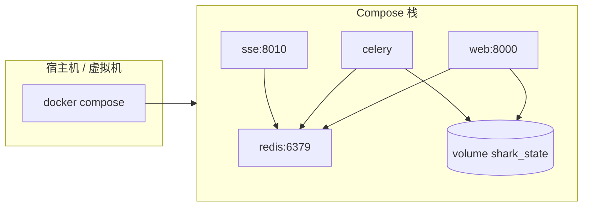

# shark-aiops 部署文档

本文描述 **中心控制面** 与 **边缘探针** 的部署方式、环境变量、网络关系与常见问题。架构与版本依赖总览见根目录 **[README.md](../README.md)**。

---

## 1. 部署架构



| 服务 | 镜像/构建 | 端口 | 职责 |
|------|-----------|------|------|
| **redis** | `redis:7-alpine` | 6379 | Celery Broker、Result Backend、Agent 事件 Pub/Sub |
| **web** | 项目 `Dockerfile` | 8000 | Nginx + Gunicorn + 静态 SPA + `/api/*` |
| **celery** | 同上 | — | `celery -A shark_platform worker`，执行 LangGraph 任务 |
| **sse** | 同上 | 8010 | `uvicorn sse_server:app`，浏览器 SSE 长连接 |

**数据卷 `shark_state`**：挂载到 **`/app/state`**，Web 与 Celery **共享** 同一份 **SQLite**（`state/db.sqlite3`）。仅 Celery 与 Web 必须共享该卷；Redis、SSE 无状态（配置走环境变量）。

---

## 2. 中心端：Docker Compose（推荐）

### 2.1 前置条件

- 已安装 **Docker** 与 **Docker Compose V2**
- 仓库根目录可执行构建（需能拉取 `node:18-slim`、`python:3.9-slim`、`redis:7-alpine`）

### 2.2 首次启动

```bash
cd /path/to/shark-Platform
cp .env.example .env
# 编辑 .env：至少设置 DJANGO_SECRET_KEY；生产务必设置 SHARK_EDGE_TOKEN
docker compose up -d --build
```

### 2.3 验证

```bash
curl -s http://127.0.0.1:8000/api/system/health
# 期望: {"status":"ok"}

curl -s -o /dev/null -w "%{http_code}" http://127.0.0.1:8010/api/agent/stream/test-run-id
# 期望: 200 或 400（run_id 校验）；说明 sse 进程在监听
```

浏览器访问 **http://localhost:8000** 登录控制台。

### 2.4 默认账号与安全

- `entrypoint.sh` 会在无 `admin` 用户时创建：**用户名 `admin`，密码 `admin`**
- **生产环境**：立即修改密码；将 **`DEBUG=False`**；收紧 **`ALLOWED_HOSTS`**、**`CSRF_TRUSTED_ORIGINS`**

### 2.5 SSE 与浏览器的地址

Django 返回给前端的 SSE 根地址由 **`AGENT_SSE_PUBLIC_BASE`** 决定（无尾斜杠）。

- 用户在 **宿主机浏览器** 访问 `http://localhost:8000` 时，应设置：  
  **`AGENT_SSE_PUBLIC_BASE=http://localhost:8010`**（或你的域名 + 8010 反代路径）
- 若 SSE 只暴露在 **Docker 内网** 名（如 `http://sse:8010`），浏览器无法连接，**必须**改为宿主机或 Ingress 可达的 URL

### 2.6 环境变量说明（中心）

| 变量 | 必填 | 说明 |
|------|------|------|
| `DJANGO_SECRET_KEY` | 生产必填 | Django 密钥 |
| `DEBUG` | 建议生产 `False` | 调试模式 |
| `ALLOWED_HOSTS` | 生产建议收紧 | 逗号分隔 |
| `CSRF_TRUSTED_ORIGINS` | HTTPS 场景必填 | 逗号分隔完整源，如 `https://ops.example.com` |
| `CELERY_BROKER_URL` | Compose 已设 | 与 `CELERY_RESULT_BACKEND` 通常同为 Redis |
| `AGENT_EVENT_REDIS_URL` | 可选 | 不填则与 `CELERY_BROKER_URL` 逻辑一致（代码侧） |
| `AGENT_SSE_PUBLIC_BASE` | **强烈建议显式设置** | 浏览器可访问的 SSE 根 URL |
| `SHARK_EDGE_TOKEN` | 使用边缘探针时必填 | 与边缘 **`SHARK_AIOPS_EDGE_TOKEN`** 一致；为空时边缘接口返回 401 |
| `PROMETHEUS_URL` | 可选 | SRE 工具 / Agent 查询 Prometheus 的根地址 |
| `SSE_CORS_ORIGINS` | 可选 | `sse_server` 允许的 Origin，逗号分隔；默认示例含 localhost:8000 |

示例见 **`.env.example`**。

### 2.7 LangGraph 与 Redis Checkpointer

官方 **`langgraph-checkpoint-redis`** 依赖 **RedisJSON + RediSearch**（或 **Redis 8+** 等效能力）。若使用 **纯单机 redis:alpine** 无模块，图执行可能在 checkpoint 阶段失败。

**处理建议**：

- 生产换 **Redis Stack** 或云厂商兼容实例；或  
- 在开发环境暂时关闭 / 替换 Checkpointer（需改代码，不在本文展开）

---

## 3. 中心端：本地开发（无 Compose）

适合改后端 / 前端联调。

```bash
python3.9 -m venv .venv
source .venv/bin/activate
pip install -r requirements.txt
mkdir -p state
python manage.py migrate
python manage.py runserver 0.0.0.0:8000
```

另开终端：

```bash
export CELERY_BROKER_URL=redis://127.0.0.1:6379/0
celery -A shark_platform worker -l info
```

再开终端：

```bash
export CELERY_BROKER_URL=redis://127.0.0.1:6379/0
uvicorn sse_server:app --host 0.0.0.0 --port 8010
```

前端：

```bash
cd frontend
npm install --legacy-peer-deps
npm run dev
```

`vite` 代理 `/api` 到 `8000`（见 `vite.config.ts`）。本地需本机 **Redis** 与正确的 **`AGENT_SSE_PUBLIC_BASE`**（例如 `http://127.0.0.1:8010`）。

---

## 4. 边缘端：go-agent（系统探针）

### 4.1 编译

```bash
cd go-agent
go mod tidy
go build -o shark-agent .
```

### 4.2 环境变量

| 变量 | 说明 |
|------|------|
| `SHARK_AIOPS_CENTER_URL` | 中心根 URL，**无**尾斜杠，如 `https://ops.example.com` |
| `SHARK_AIOPS_EDGE_TOKEN` | 与中心 **`SHARK_EDGE_TOKEN`** 完全一致 |
| `SHARK_AIOPS_NODE_ID` | 可选；默认用主机 HostID |
| `SHARK_AIOPS_INTERVAL` | 心跳间隔，Go duration，默认 `30s` |

### 4.3 运行

```bash
export SHARK_AIOPS_CENTER_URL=https://你的中心域名
export SHARK_AIOPS_EDGE_TOKEN=与中心相同
./shark-agent
```

请求目标：`POST {CENTER_URL}/api/edge/heartbeat`，Header：`X-Shark-Edge-Token: <token>`。

---

## 5. 边缘端：go-log-collector（日志采集）

### 5.1 编译

```bash
cd go-log-collector
go build -o shark-log-collector .
```

### 5.2 环境变量

| 变量 | 说明 |
|------|------|
| `SHARK_AIOPS_CENTER_URL` | 同上 |
| `SHARK_AIOPS_EDGE_TOKEN` | 同上 |
| `SHARK_AIOPS_LOG_SOURCE` | 逻辑源标识，默认 `edge` |
| `SHARK_AIOPS_LOG_PATHS` | 逗号分隔文件路径；**空则读 stdin** |

### 5.3 运行示例

```bash
export SHARK_AIOPS_EDGE_TOKEN=xxx
export SHARK_AIOPS_LOG_PATHS=/var/log/nginx/access.log
./shark-log-collector
```

或管道：

```bash
tail -F /var/log/app.log | ./shark-log-collector
```

请求体为 JSON：`{ "source": "...", "lines": ["...", ...] }`，路径：`POST /api/edge/logs`。

---

## 6. 生产环境建议

1. **数据库**：将 `DATABASES` 从 SQLite 改为 **PostgreSQL**（或 MySQL），Web 与 Celery 共用同一连接配置与迁移。  
2. **密钥**：`DJANGO_SECRET_KEY`、`SHARK_EDGE_TOKEN` 使用密钥管理或 K8s Secret。  
3. **TLS**：对 8000/8010 做 **反向代理**（Nginx / Ingress），统一 HTTPS。  
4. **资源**：Celery Worker 按并发与 LangGraph 复杂度调整 CPU/内存；SSE 连接数与超时在网关层限流与保活。  
5. **观测**：对 `web`、`celery`、`sse`、`redis` 配置日志与指标采集。

---

## 7. 常见问题

| 现象 | 可能原因 | 处理 |
|------|-----------|------|
| 前端「思维流」连不上 | `AGENT_SSE_PUBLIC_BASE` 指向容器内地址 | 改为浏览器可达的宿主机或域名 URL |
| SSE 报 CORS | `SSE_CORS_ORIGINS` 未包含前端源 | 增加前端 Origin |
| 边缘 401 | 中心未设 `SHARK_EDGE_TOKEN` 或边缘 Token 不一致 | 两边配置相同随机串 |
| Celery 任务报错 checkpoint | Redis 无 JSON/Search 模块 | 换 Redis Stack 或调整 Checkpointer |
| Web 与 Celery 数据不一致 | 未共享 `state` 卷 | Compose 中两者均挂载 `shark_state:/app/state` |

---

## 8. 相关文件

| 路径 | 说明 |
|------|------|
| `docker-compose.yml` | 中心四服务编排 |
| `Dockerfile` | 前端构建 + Python 运行镜像 |
| `entrypoint.sh` | 迁移、默认管理员、Gunicorn + Nginx |
| `nginx.conf` | SPA 与 API 反代 |
| `go-agent/README.md` | 探针补充说明 |
| `go-log-collector/README.md` | 采集器补充说明 |
